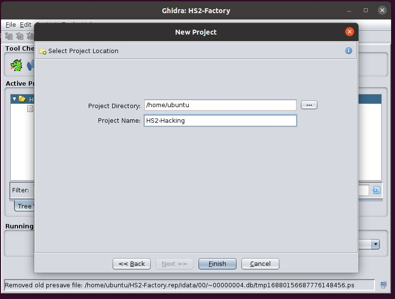

# HS2 Factory Account Privilege Escalation


This is still in progress but this is how i took apart the HS2 Firmware and changed the "user setup" to the "Factory setup".

We start by downloading the firmware from the HS2 website. This can be done with a linux program such as wget, or you can do it with your web browser:

```
ubuntu@ubuntu2-VirtualBox:~/reverse$ wget https://www.ailunce.com/Assets/file/Ailunce-HS2-FW-V1.37.zip
--2021-06-08 22:19:19--  https://www.ailunce.com/Assets/file/Ailunce-HS2-FW-V1.37.zip
Resolving www.ailunce.com (www.ailunce.com)... 47.253.10.103
Connecting to www.ailunce.com (www.ailunce.com)|47.253.10.103|:443... connected.
HTTP request sent, awaiting response... 200 OK
Length: 431910 (422K) [application/x-zip-compressed]
Saving to: ‘Ailunce-HS2-FW-V1.37.zip’

Ailunce-HS2-FW-V1.37.zip                           100%[===============================================================================================================>] 421.79K   923KB/s    in 0.5s    

2021-06-08 22:19:20 (923 KB/s) - ‘Ailunce-HS2-FW-V1.37.zip’ saved [431910/431910]

ubuntu@ubuntu2-VirtualBox:~/reverse$ 
```
When the firmware has been downloaded we extract the zip file that its currently compressed into.

```
ubuntu@ubuntu2-VirtualBox:~/reverse$ unzip Ailunce-HS2-FW-V1.37.zip 
Archive:  Ailunce-HS2-FW-V1.37.zip
  inflating: AilunceHS2-FW-V1.3.7.dfu  
  inflating: Ailunce HS2 FW-V1.3.7 changelog.txt  
ubuntu@ubuntu2-VirtualBox:~/reverse$ ls
'Ailunce HS2 FW-V1.3.7 changelog.txt'   AilunceHS2-FW-V1.3.7.dfu   Ailunce-HS2-FW-V1.37.zip
ubuntu@ubuntu2-VirtualBox:~/reverse$ 
```

After the firmware has been extracted we can see that the firmware file is further compressed 
in a DFU extention. 

This can be extracted, in turn, by using the dfuse-pack.py Python application attached
to this git repo.

```
ubuntu@ubuntu2-VirtualBox:~/reverse$ python3 dfuse_pack.py -d AilunceHS2-FW-V1.3.7.dfu
File: "AilunceHS2-FW-V1.3.7.dfu"
b'DfuSe' v1, image size: 797169, targets: 1
b'Target' 0, alt setting: 0, name: "b'ST...'", size: 796884, elements: 1
  0, address: 0x08000000, size: 796876
    DUMPED IMAGE TO "AilunceHS2-FW-V1.3.7.dfu.target0.image0.bin"
usb: 0483:0000, device: 0x0000, dfu: 0x011a, b'UFD', 16, 0x16c30ebd
ubuntu@ubuntu2-VirtualBox:~/reverse$ ls
'Ailunce HS2 FW-V1.3.7 changelog.txt'   AilunceHS2-FW-V1.3.7.dfu   AilunceHS2-FW-V1.3.7.dfu.target0.image0.bin   Ailunce-HS2-FW-V1.37.zip   dfuse_pack.py
ubuntu@ubuntu2-VirtualBox:~/reverse$ 

```

As you can see in the above output, a bin file is created called `AilunceHS2-FW-1.3.5.dfu.target0.image0.bin`. This can then be inspected by a tool built into linux called `strings`. Lots of strings where found when searching the binary file so I decided to source out a few intresting ones.

Using the `strings` tool is as simple as running the tool with the file name of the firmware. 

```
ubuntu@ubuntu2-VirtualBox:~/reverse$ strings AilunceHS2-FW-V1.3.7.dfu.target0.image0.bin |grep setup
agent setup
factory setup
user setup
ubuntu@ubuntu2-VirtualBox:~/reverse$ 

```
Based on the above output we can see there appear to be different levels of access, 
This was confirmwed by Ailunce in their blog post below, where they disclose the route one needs to follow to enter the hidden menu screen within the SET menu on the HS2. The same blog post then goes on to further expose the "agent setup" user access. 

Blog post: https://www.ailunce.com/blog/setting-item-of-your-Ailunce-HS2

Exact wording from the blog post:

```
It's a hidden setting item. You can do as below if you want to set ITU region.

if you haven't activated your HS2: turn on=>select "NO"=>enter 685911=>long press MENU=>SET=>ham area, via left and right key to select ITU=>long press MENU key to save and exit

if you have activated your HS2: turn on=>long press MENU=>Cursor on the top option above, long press PA, enter 685911=>long press MENU key to save and exit=>reenter SET=>ham area, via left
```
After confirming the access works I tried to manually brute-force different user accounts by typing in known default pin numbers fitting the lenght of its policy. This is when the "user setup" acount was found by using "000000" as the pin number althought it was later found this user access was not useful as it had even less rights then the "agent setup" account. 

This prompted me to further inspect the binary file. Through expecerice I knew [Ghidra](https://ghidra-sre.org/) would be the perfect tool for the job.

Installing Ghidra can be found here: http://www.ylmzcmlttn.com/2019/03/26/ghidra-installation-on-ubuntu-18-04-16-04-14-04/

Once installed we start it:

```
ubuntu@ubuntu2-VirtualBox:~/ghidra_9.2.3_PUBLIC$ ./
docs/       Extensions/ Ghidra/     ghidraRun   GPL/        licenses/   server/     support/    
ubuntu@ubuntu2-VirtualBox:~/ghidra_9.2.3_PUBLIC$ ./ghidraRun 
```

Then we proceed by clicking File > New Project. This will then prompt for the type of project. In this write up this was done
as a Non-Shared Project. 

We select the type and continue by clicking "Next":


We then create a new project name and directory for the working directory:

projectname.JPG)

Next we need to import the binary file that was previously extracted with the Python script. This can be done
by going to File > Import file as shown in the following screenshot:


We are then prompted to set the type of language achitecture for the binary file that is being imported:


By removing the cover of the radio it is possible to identify the processor and the type:


[Processor user manual](https://www.st.com/resource/en/datasheet/dm00071990.pdf)

With the following information it is possible to work out the Language for the chipset is Cortex and size of 32 little endian. By then selecting the right instruction set the software will be able to apply its helper plugins to try and show how the application may look deconstructed, saving us from having to learn Assembler language from scratch. 

The image below shows how we search for the cortext language settings when importing the binary to Ghidra:


Before applying the the type of language we need to tell Ghidra where to look for the starting point of the data that will be imported.
Going back to the notes we kept when extracting the firmware, we notice the starting address is 0x08000000. This needs to be applied to the settings:


After allowing all the changes and importing the file we will then be prompted with the question of whether we would like to perform analysis on the file for now. We click "No" as more changes need to be made before procceding:


As previously mentioned, we need to perform some more changes before we can proceed with performing analysis on the file. 
We start those changes by navigating to the Memory manp Tool included within:


Then we proceed to create a new memory allocation point by clicking the green cross button on the right hand 
side, and by looking at the memory allocation map in the documentation for the memory to extract itself into.


Finally, for memory allocation we again use the resources from the documentation for the processor. 
It was found that by setting the RAM we could allocate instructions into virtul memory for later analysis: 


Now that all the memory allocation sections have been created it is possible to use the built in analysis tools
by navingating to, and manully triggering them:


When the analysis button has been pressed the application will prompt us for the settings 
to be selected. For now just select the All button and monitor the bottom right hand status bar. When the status
has then stopped showing instructions the process will have completed:


 A really good video on doing exactly this can be found [here](https://www.youtube.com/watch?v=q4CxE5P6RUE)
 
After everything has completed it will then be possible to search the binary using
the global search function, using the same names we found when using the strings application:


As soon as the search begins a new window will popup and start populating results. If we click on
the first result, when everything has finished, we will notice the instruction pointers shown
in the screeshot below: 


By double clicking on the first of the green sectors to the right of the instruction 
pointers we will be taken to a new point in memory. Then, by scrolling
through the code on the right-hand side we will be able to see the three levels of user access correspond to numbers: 


We can see in the screenshot below the 3 levels of user access we were searching
for in the strings application at the beggining of the process, and which are:

* agent setup
* factory setup
* user setup


Once the varibles have been identified it is possible to patch the instruction pointers 
by right clicking and navigating to patch instruction. 
Then we will be prompted with a
warning saying the process may not work on the current architecture. This is fine, so we accept and 
continue:


In the screenshot below we can see we are allowed to edit the assembler language when patching the instructions, and that by switching the number `0x2` to `0x3` the code become `var4 == 3` where originally it was only 2:


When the values have been patched we will notice we have duplicate vaules of `var4 == 3`. This would 
create confusion within the application, and (this was found by trial and error) if the duplication is 
not fixed the resulting access will still be of the lowest level user:


To fix the duplication we follow exactly the same steps as when we changed the first varible. We navigate to the
user setup access and then change the `0x3` to `0x2`.

This should then change the "User setup" to level 2 instead of level 3 and
change the factory user to a level 3 setup, where we know the password is "000000".

And here is the bypass taking place:


Once complete you can finally export the program from ghidra by navigating to File > `Export Program`


Then you will be prompted to the file type the code will be exported to, which should be Binary, set the export folder to be the same folder we used when extracting the original dfu and, set the name as `AilunceHS2-FW-V1.3.7.dfu.target0.image0-patched.bin`:


Before repacking the DFU file its worth us using the tool `md5sum` to compare the hash of our changed file to the hash of the original file, allowing us to see if our changes have indeed taken place:
```
ubuntu@ubuntu2-VirtualBox:~/reverse$ md5sum AilunceHS2-FW-V1.3.7.dfu.target0.image0.bin
dfeaf29113a03b1eb9d8fc08291cd90a  AilunceHS2-FW-V1.3.7.dfu.target0.image0.bin
ubuntu@ubuntu2-VirtualBox:~/reverse$ md5sum AilunceHS2-FW-V1.3.7.dfu.target0.image0-patched.bin
62c51b93772cba973aa5adb6b2fdc396  AilunceHS2-FW-V1.3.7.dfu.target0.image0-patched.bin
ubuntu@ubuntu2-VirtualBox:~/reverse$ 
```

To repacking the DFU file is as simple as adding the file name that we exported from the the reverse engineering tools as the input, with patched appended to the name, the memory locator point, and the output filename as shown in the output below:

```
ubuntu@ubuntu2-VirtualBox:~/reverse$ python3 dfuse_pack.py -b 0x08000000:AilunceHS2-FW-V1.3.7.dfu.target0.image0-patched.bin AilunceHS2-FW-V1.3.7.dfu.target-patched.dfu
ubuntu@ubuntu2-VirtualBox:~/reverse$ ls
'Ailunce HS2 FW-V1.3.7 changelog.txt'   AilunceHS2-FW-V1.3.7.dfu.target0.image0.bin           AilunceHS2-FW-V1.3.7.dfu.target-patched.dfu   dfuse_pack.py
 AilunceHS2-FW-V1.3.7.dfu               AilunceHS2-FW-V1.3.7.dfu.target0.image0-patched.bin   Ailunce-HS2-FW-V1.37.zip
ubuntu@ubuntu2-VirtualBox:~/reverse$ 
```

Then we flash to our radio like normal. 

Note: As you are following these instructions, please remember that any changes you make could potentially brick your radio. I do not take
any responsibility for the actions you perform.

The final result of our work, where we can see the following firmware files have been created: https://github.com/Zy0d0x0/HS2-Firmware

# Credits

* Editing & proof-reading done by M7GCH.

